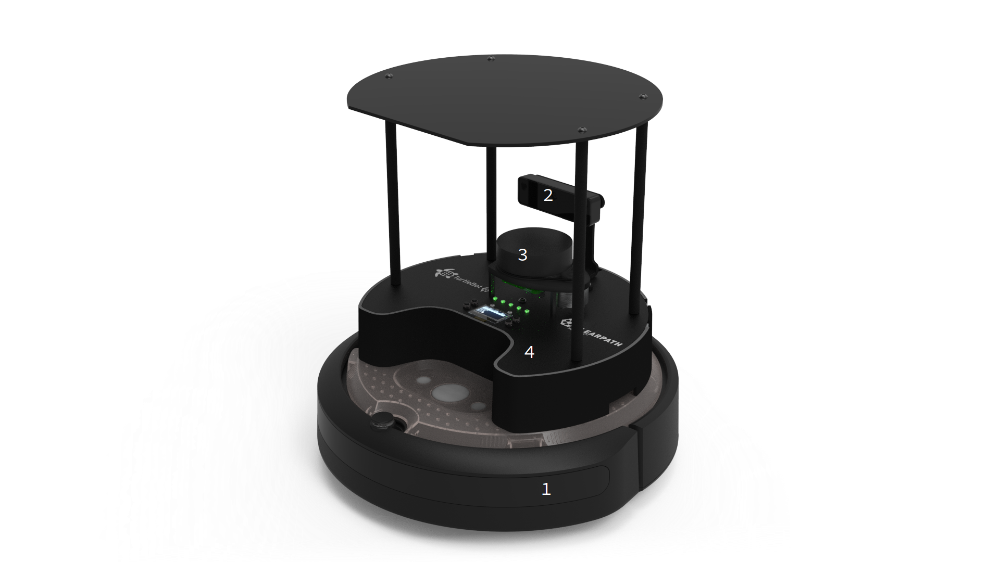
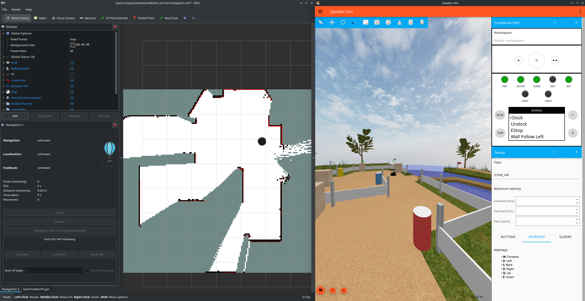
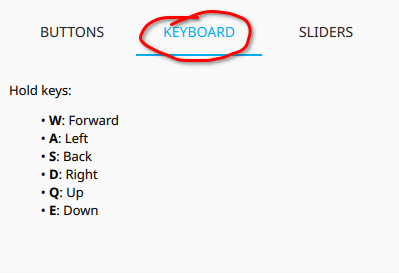
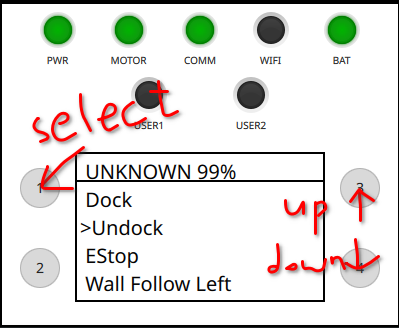
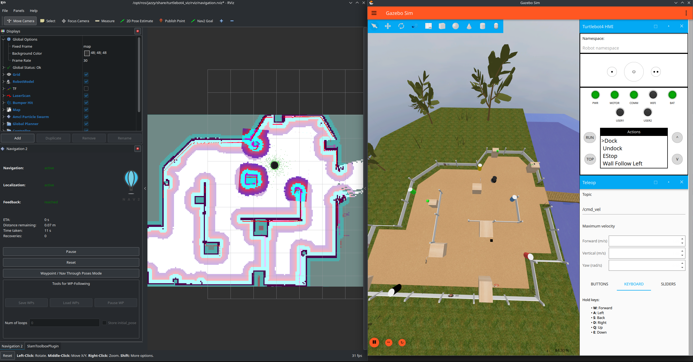

# Tutorial 3: The Turtlebot 4

#### Development of Intelligent Systems, 2024

In this exercise, you will familiarize yourself with the Turtlebot 4 robot platform that you will be using throughout the course for practical work. The robot is composed of the:
1. **iRobot Create 3** platform (based on the Roomba i-series vacuum cleaners)
2. **Luxonis Oak-D Pro** stereo camera depth sensor
3. **Slamtec RPLIDAR-A1 2D** triangulation lidar sensor
4. **Raspberry Pi 4 SBC** with a Turtlebot HAT board


*Image source: [Clearpath Robotics](https://turtlebot.github.io/turtlebot4-user-manual/overview/features.html)*

You can use [the official TB4 manual](https://turtlebot.github.io/turtlebot4-user-manual/) as a reference guide.

## Turtlebot 4 packages installation

Here we present the steps needed for installing the Turtlebot 4 packages on a native Ubuntu 22.04 + ROS2 Humble. For WSL/V/Docker installation you will need to check the instructions linked above, and possible other sources.

0. Update package manager:
```
    sudo apt update
```
1. Install Ignition Gazebo Fortress:
```
    sudo sh -c 'echo "deb http://packages.osrfoundation.org/gazebo/ubuntu-stable `lsb_release -cs` main" > /etc/apt/sources.list.d/gazebo-stable.list'
    wget http://packages.osrfoundation.org/gazebo.key -O - | sudo apt-key add -
    sudo apt-get update && sudo apt-get install ignition-fortress
```
2. Turtlebot related packages:
```
    sudo apt install ros-humble-turtlebot4-simulator ros-humble-turtlebot4-description \
    ros-humble-turtlebot4-msgs ros-humble-turtlebot4-navigation \
    ros-humble-turtlebot4-node ros-humble-turtlebot4-desktop \
    ros-humble-laser-filters ros-humble-turtle-tf2-py
```
3. Download and build `dis_tutorial3`

> **Keep in mind:** The same hardware is used not just by your group but also by other students this year as well as in future years. So pay attention to the maintenance instructions to maximize the life expectancy of components. Frequent violations of these instructions will be sanctioned by reducing the grade of your group.

### Running the simulation

Our ultimate goal is to have the robot navigate autonomously. The first step towards this capability is to build a map of the working environment of the robot. For building a map we will use the slam_toolbox package which builds a map based on the lidar data and the odometry data from the robot movement. 

Now close all the running nodes and launch the Turtlebot 4 simulation + SLAM + rviz. Open a new terminal and run:

    ros2 launch dis_tutorial3 sim_turtlebot_slam.launch.py

This will start the necessary nodes for building a map. You should see the Ignition Gazebo Fortress simulator with a custom GUI for the Turtlebot4, and the RViz tool.



##### Running the simulation without a GPU

If you do not have a dedicated GPU the simulation might run slow. If the Real Time Factor (RTF) in the bottom right of Ignition Gazebo is more than 30-40% this should be enough to use the simulation normally. The problem is, that Ignition Gazebo (inlike Gazebo classic) only supports the `gpu_laser` plugin to simulate the lidar sensor which in the absence of a dedicated GPU does not generate ranges. You can tell that this is an issue if you start `sim_turtlebot_slam.launch.py` and in RViz you do not see the laser or the map that is being built. Luckily, there is a workaround to force the `gpu_laser` plugin to use CPU for rendering. You need to set up `MESA_GL_VERSION_OVERRIDE=3.3` and `LIBGL_ALWAYS_SOFTWARE=true` in your .bashrc file. For example, the last few lines of my .bashrc look like this:
```
    export ROS_LOCALHOST_ONLY=1                # Run ROS on the local machine, do not look for nodes and topic on the local network
    export MESA_GL_VERSION_OVERRIDE=3.3        # 1. Hack for laser simulation
    export LIBGL_ALWAYS_SOFTWARE=true          # 2. Hack for laser simulation

    source /opt/ros/humble/setup.bash          # Load the ROS installation and packages
    source /home/matej/ROS2/install/setup.bash # Load the packages from my workspace
```

### Building a map

To build the map we should move the robot around the course using the teleop node:

    ros2 run teleop_twist_keyboard teleop_twist_keyboard

You can also use the the GUI in Gazebo:



Before you move around the robot, make sure to undock it. For now, do this using the GUI:



Now move about the course until you get a relatively good map. To build a good map:
 - Move the robot slowly. When the robot is moving quickly it can lose the connection between individual scans or build up too much odometry error between map updates.
- Observe the current state that is shown in Rviz. The map is not refreshed in real time but rather in steps therefore make sure that the map has indeed been updated before moving on.

Once you are satisfied with the map you can save it by executing:

    ros2 run nav2_map_server map_saver_cli -f ~/path/to/your/map

Do not add any extensions to the name of your map, as the map_saver will create two different files for storing map data. The first one is a `.yaml` file containing the name of the image for the map, the origin of the image, the metric length of a pixel in the map and the thresholds for occupied and free space. The other file is a `.pgm` image file (portable gray map) which you can open in most image editors. This is useful for fixing minor imperfections. 

When you have built a good enough map, close all running nodes.

### Navigation

The Turtlebot 4 uses Nav2 which provides perception, planning, control, localization, visualization, and much more to build autonomous systems. This will compute an environmental model from sensor and semantic data, dynamically path plan, compute velocities for motors, avoid obstacles, and structure higher-level robot behaviors. You can find more info about Nav2 [here](https://navigation.ros.org/).

If you have built a map of the course, we are finally ready to let the robot drive on its own. In one terminal start the simulation:

    ros2 launch dis_tutorial3 sim_turtlebot_nav.launch.py

You should see RViz with the already loaded map:



You can send navigation goal to the robot from RViz. You can load your own custom map by modifying the `sim_turtlebot_nav.launch.py` launch file:

    DeclareLaunchArgument('map', default_value=PathJoinSubstitution(
                          [pkg_dis_tutorial3, 'maps', 'map.yaml']),
                          description='Full path to map yaml file to load')

You can also give it as a parameter in the command line if you wish.

### Testing with different positions of faces

There are three worlds in this repository: `dis.sdf`, `demo1.sdf` and `demo2.sdf`. The only differences between the worlds are the positions of the faces, for testing your solution for Task1. Since the worlds are geometrically the same, you can use the same map on all of them. By default the `dis.sdf` world is loaded. To load a different world, you can add the `world` argument in the `launch` command e.g.:

```
    ros2 launch dis_tutorial3 sim_turtlebot_slam.launch.py world:=demo1
```
You can also change the `default_value` of the `world` in the `.launch` file itself, for example in `sim_turtlebot_slam.launch.py`:

```
    DeclareLaunchArgument('world', default_value='demo1',
                          description='Ignition World'),
```

### Face Detection and Localization

As part of Task 1, you need to detect the faces in the course. For this, you need to install some additional Python packages:

    pip install ultralytics
    pip install opencv-python
    pip install "numpy<2"

Then you can run the person detector node, which sends a marker to RViz at the detected locations:

    ros2 run dis_tutorial3 detect_people.py

This node uses a pretrained YOLOv8 model. It can detect many different categories, but we are only using the "person" category.

### Sending movement goals from a node

In the `robot_commander.py` node you have examples of how to programatically send navigation goals to the robot. Explore the code after running it:

    ros2 run dis_tutorial3 robot_commander.py

# Homework 3

Build a map of the course and save it to the disk. Then, load the map and drive the robot around, detect faces and save their positions. Finally, write a script that moves the robot between the positions of the detected faces (you can modify the `robot_commander.py` script for that).

### Resources

[The official TB4 user manual](https://turtlebot.github.io/turtlebot4-user-manual/)  
[TB4 navigation tutorial](https://turtlebot.github.io/turtlebot4-user-manual/tutorials/turtlebot4_navigator.html)   
[Nav2](https://navigation.ros.org/)   
[TB4 Tutorials](https://github.com/turtlebot/turtlebot4_tutorials)   
[Everything you need](google.com)   
