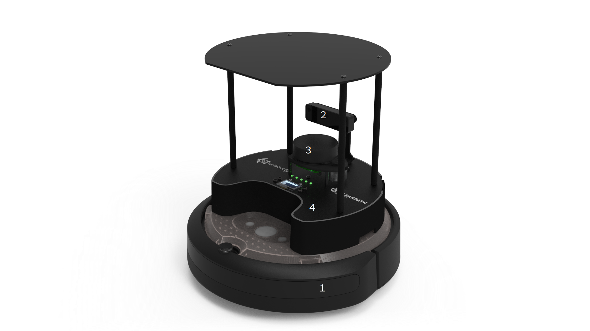
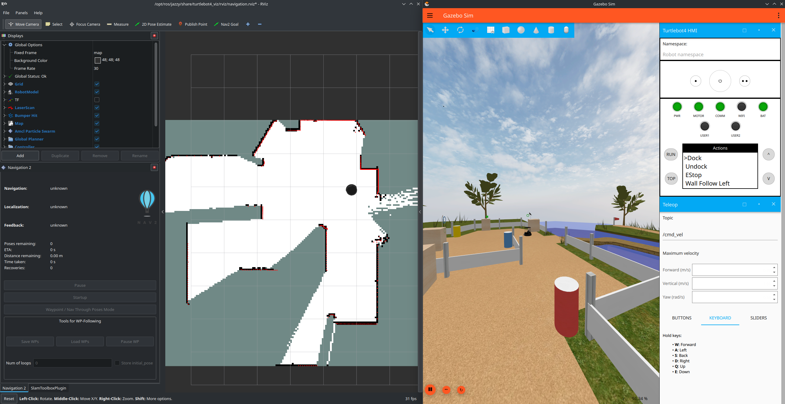
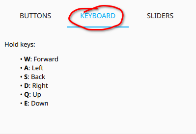
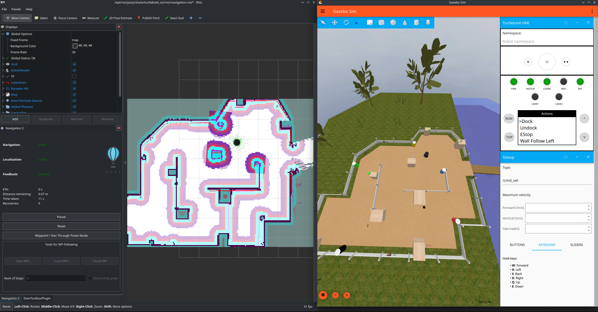
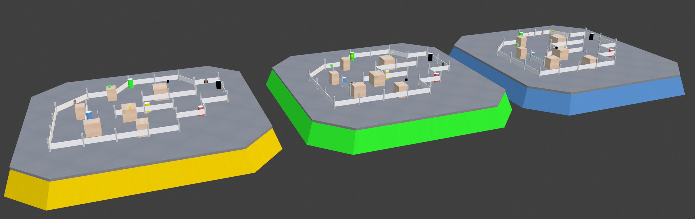

# Tutorial 3: The Turtlebot 4

#### Development of Intelligent Systems, 2026

In this exercise, you will familiarize yourself with the Turtlebot 4 robot platform that you will be using throughout the course for practical work. The robot is composed of the:
1. **iRobot Create 3** platform (based on the Roomba i-series vacuum cleaners)
2. **Luxonis Oak-D Pro** stereo camera depth sensor (only in the sim)
3. **Slamtec RPLIDAR-A1 2D** triangulation lidar sensor
4. **Raspberry Pi 4 SBC** with a Turtlebot HAT board


*Image source: [Clearpath Robotics](https://turtlebot.github.io/turtlebot4-user-manual/overview/features.html)*

You can use [the official TB4 manual](https://turtlebot.github.io/turtlebot4-user-manual/) as a reference guide.

## Turtlebot 4 Simulator Installation

Here we present the steps needed for installing the Turtlebot 4 packages on a native Ubuntu 24.04 + ROS 2 Jazzy. For WSL/pixi/Docker installation you will need to check the instructions linked above, and possible other sources. Lab PCs are already preinstalled with everything you need.

1. Install Turtlebot related packages and the Zenoh middleware:
```bash
sudo apt update && sudo apt install curl \
ros-jazzy-turtlebot4-simulator \
ros-jazzy-irobot-create-nodes \
ros-jazzy-turtlebot4-description \
ros-jazzy-turtlebot4-msgs \
ros-jazzy-turtlebot4-navigation \
ros-jazzy-turtlebot4-node \
ros-jazzy-rmw-zenoh-cpp \
ros-jazzy-laser-filters \
ros-jazzy-teleop-twist-keyboard
```
2. Install Gazebo Harmonic:
```bash
sudo curl https://packages.osrfoundation.org/gazebo.gpg --output /usr/share/keyrings/pkgs-osrf-archive-keyring.gpg
echo "deb [arch=$(dpkg --print-architecture) signed-by=/usr/share/keyrings/pkgs-osrf-archive-keyring.gpg] http://packages.osrfoundation.org/gazebo/ubuntu-stable $(lsb_release -cs) main" | sudo tee /etc/apt/sources.list.d/gazebo-stable.list > /dev/null
sudo apt update && sudo apt install gz-harmonic
```

3. Clone and build `dis_tutorial3`, i.e. this repo:

```bash
cd ~/colcon_ws/src
git clone https://github.com/vicoslab/dis_tutorial3.git
cd ..
colcon build --symlink-install
```

## Running the simulation

### Setup

For the simulation setup, we'll be using the [Zenoh RMW](https://docs.ros.org/en/jazzy/Installation/RMW-Implementations/Non-DDS-Implementations/Working-with-Zenoh.html) which was installed amongst the packages above. To enable it and configure Gazebo environment variables, add the following lines to your `.bashrc` file:

```bash
export RMW_IMPLEMENTATION=rmw_zenoh_cpp
export GZ_VERSION=harmonic
export IGN_IP=127.0.0.1
```

Then restart any existing terminal windows and start the router:

```bash
pkill -9 -f ros && ros2 daemon stop
ros2 run rmw_zenoh_cpp rmw_zenohd
```

By default, the router will only relay data between nodes on localhost. For more advanced configurations, see the [github documentation](https://github.com/ros2/rmw_zenoh?tab=readme-ov-file#configuration).


### Run SLAM


Our ultimate goal is to have the robot navigate autonomously. The first step towards this capability is to build a map of the working environment of the robot. For building a map we will use the slam_toolbox package which builds a map based on the lidar data and the odometry data from the robot movement. 

Now close all the running nodes and launch the Turtlebot 4 simulation + SLAM + rviz. Open a new terminal and run:

```bash
ros2 launch dis_tutorial3 sim_turtlebot_slam.launch.py
```

This will start the necessary nodes for building a map. You should see the Ignition Gazebo Fortress simulator with a custom GUI for the Turtlebot4, and the RViz tool.



#### Running the simulation without a GPU

If you do not have a dedicated GPU the simulation might run slow. If the Real Time Factor (RTF) in the bottom right of Ignition Gazebo is more than 30-40% this should be enough to use the simulation normally. The problem is, that Ignition Gazebo (inlike Gazebo classic) only supports the `gpu_laser` plugin to simulate the lidar sensor which in the absence of a dedicated GPU does not generate ranges. You can tell that this is an issue if you start `sim_turtlebot_slam.launch.py` and in RViz you do not see the laser or the map that is being built. Luckily, there is a workaround to force the `gpu_laser` plugin to use CPU for rendering. You need to set up `MESA_GL_VERSION_OVERRIDE=3.3` and `LIBGL_ALWAYS_SOFTWARE=true` in your .bashrc file. For example, the last few lines of my .bashrc look like this:
```bash
export MESA_GL_VERSION_OVERRIDE=3.3 # 1. Hack for laser simulation
export LIBGL_ALWAYS_SOFTWARE=true # 2. Hack for laser simulation

source /opt/ros/jazzy/setup.bash  # Load the ROS installation and packages
source /home/username/colcon_ws/install/setup.bash # Load the packages from my workspace
```

#### DPI Scaling

In case you see Rviz2 or Gazebo flicker, you add the following in your .bashrc file to disable scaling:

```bash
unset QT_SCREEN_SCALE_FACTORS
```

#### Restarting the sim

ROS 2 does not track its own processes and many additional ones like gazebo gui and server will fork and might remain active after the launch file is closed, so we've provided a `kill_ros_processes.sh` script that should clean up anything still running from a previous session.

### Building a map

To build the map we should move the robot around the course using the teleop node:

```bash
ros2 run teleop_twist_keyboard teleop_twist_keyboard --ros-args -p stamped:=true
```
You can also use the the GUI in Gazebo:



Now move about the course until you get a relatively good map. To build a good map:
- Move the robot slowly. When the robot is moving quickly it can lose the connection between individual scans or build up too much odometry error between map updates.
- Observe the current state that is shown in Rviz. The map is not refreshed in real time but rather in steps therefore make sure that the map has indeed been updated before moving on.

Once you are satisfied with the map you can save it by executing:

```bash
ros2 run nav2_map_server map_saver_cli -f ~/path/to/your/map
```

Do not add any extensions to the name of your map, as the map_saver will create two different files for storing map data. The first one is a `.yaml` file containing the name of the image for the map, the origin of the image, the metric length of a pixel in the map and the thresholds for occupied and free space. The other file is a `.pgm` image file (portable gray map) which you can open in most image editors. This is useful for fixing minor imperfections. 

When you have built a good enough map, close all running nodes.

#### Renaming saved maps

If you want to rename a map you must modify the .yaml file as well, since it contains the .pgm name:

**bird_demo.yaml**
```yaml
image: bird_demo.pgm
mode: trinary
resolution: 0.050
origin: [-4.466, -8.077, 0]
negate: 0
occupied_thresh: 0.65
free_thresh: 0.196
```

### Navigation

The Turtlebot 4 uses Nav2 which provides perception, planning, control, localization, visualization, and much more to build autonomous systems. This will compute an environmental model from sensor and semantic data, dynamically path plan, compute velocities for motors, avoid obstacles, and structure higher-level robot behaviors. You can find more info about Nav2 [here](https://navigation.ros.org/).

If you have built a map of the course, we are finally ready to let the robot drive on its own. In one terminal start the simulation:

```bash
ros2 launch dis_tutorial3 sim_turtlebot_nav.launch.py
```

You should see RViz with the already loaded map:



You can send navigation goal to the robot from RViz. You can load your own custom map by modifying the `sim_turtlebot_nav.launch.py` launch file:

```python
DeclareLaunchArgument(
    'map',
    default_value=PathJoinSubstitution([pkg_dis_tutorial3, 'maps', 'map.yaml']), #concats location of the given package and subfolder
    description='Full path to map yaml file to load'
)
```

You can also set parameter in the command line, e.g. `ros2 launch dis_tutorial3 sim_turtlebot_nav.launch.py map:=/home/rins/map.yaml`. 


### Face Detection and Localization

As part of Task 1, you need to detect the faces in the course. The easiest way to run YOLO models is using the [Ultralytics](https://www.ultralytics.com/) python packages. 

On the lab PCs, we've preinstalled a virtual environment with all required packages which you can source using:
```bash
source /opt/ultralytics/bin/activate
```

Then run the person detector node, which sends a marker to RViz at the detected locations:

```bash
ros2 run dis_tutorial3 detect_people.py
```

This node uses a pretrained YOLOv8 model. It can detect many different categories, but we are only using the "person" category.


On your own machines you can install ultralytics and its dependencies using:

```bash
# ROS packages are generally designed to work with apt versions of python packages
sudo apt install python3-pip python3-opencv python3-numpy ros-jazzy-cv-bridge

# we need ultralytics from pip, since it's not on apt, which adds an overlay of some additional pip packages
pip install ultralytics --break-system-packages

# remove pip's numpy 2.4.2, since it breaks opencv ROS compatibility, this reverts back to using numpy 1.26.4 from apt which will work fine
pip uninstall numpy --break-system-packages
```

### Testing with different positions of faces

There are various worlds from previous years in this repository (under dis_tutorial3/world/2024 and 2025) which you can explore to get a feel for what to expect.

The default world is currently set to `bird_demo1` (an example world for last year's Task 2). To load a different world, you can add the `world` argument in the `launch` command without any prefix e.g.:

```bash
ros2 launch dis_tutorial3 sim_turtlebot_slam.launch.py world:=task1_blue_demo
```

You can also change the `default_value` of the `world` in the `.launch` file itself, for example in `sim_turtlebot_slam.launch.py`:

```python
DeclareLaunchArgument('world', default_value='task1_blue_demo', description='Ignition World'),
```

There are three example worlds available for this year's Task1, which use can use to build your map and test run your implementation:
- `task1_blue_demo`
- `task1_green_demo`
- `task1_yellow_demo`



### Sending movement goals from a node

In the `robot_commander.py` node you have examples of how to programatically send navigation goals to the robot. Explore the code after running it:
```bash
ros2 run dis_tutorial3 robot_commander.py
```

<br>

# Homework 3

Build a map of the course and save it to the disk. Then, load the map and drive the robot around, detect faces and save their positions. Finally, write a script that moves the robot between the positions of the detected faces (you can modify the `robot_commander.py` script for that).

## Resources

Turtlebot4:
- [The official TB4 user manual](https://turtlebot.github.io/turtlebot4-user-manual/)  
- [TB4 navigation tutorial](https://turtlebot.github.io/turtlebot4-user-manual/tutorials/turtlebot4_navigator.html)   
- [TB4 Tutorials](https://github.com/turtlebot/turtlebot4_tutorials)

Slam + Nav:
- [Slam Toolbox](https://github.com/SteveMacenski/slam_toolbox)
- [Nav2](https://docs.nav2.org/)   

Etc.
- [Kimi](https://www.kimi.com/)
- [Everything you need](google.com)
